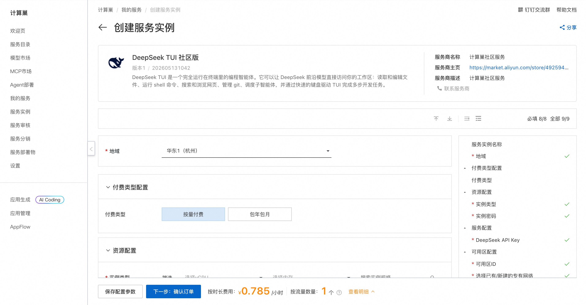
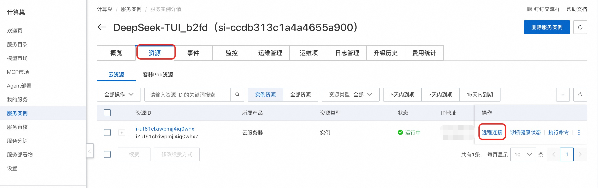
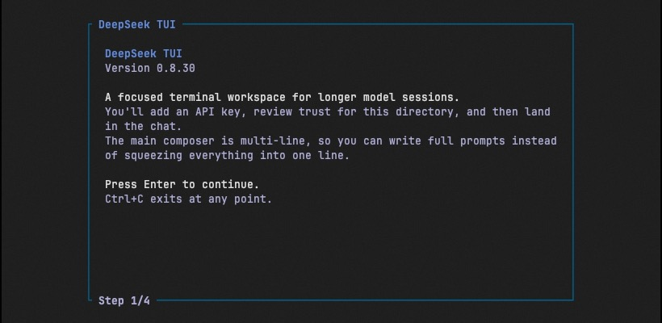
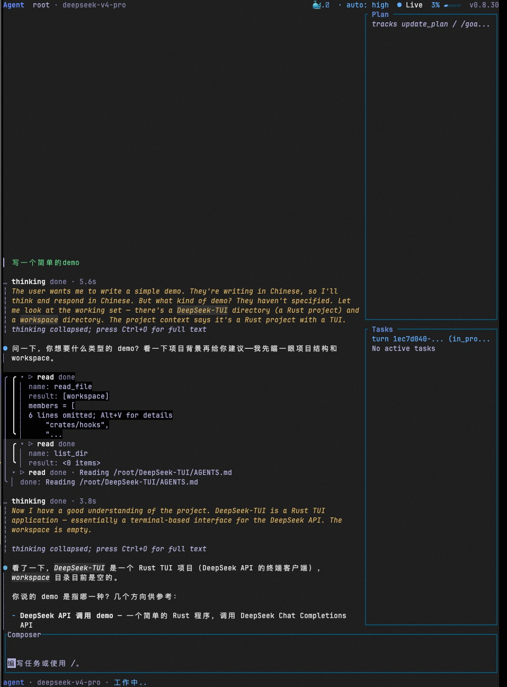

## DeepSeek TUI简介

DeepSeek TUI 是一个运行在终端中的 AI 编程智能体（Coding Agent），基于 DeepSeek V4 大模型构建。它可以读取和编辑文件、执行 Shell 命令、搜索网页、管理 Git 仓库，并从键盘驱动的 TUI 界面协调子代理完成复杂编程任务。

### 核心特性

- **Auto 模式** — 自动选择模型和推理级别（deepseek-v4-flash / deepseek-v4-pro）
- **思维链流式输出** — 实时查看 DeepSeek 推理过程
- **完整工具套件** — 文件操作、Shell 执行、Git 管理、Web 搜索/浏览、补丁应用、子代理、MCP 服务器
- **1M token 上下文** — 上下文追踪、手动或配置压缩、前缀缓存遥测
- **三种工作模式** — Plan（只读探索）、Agent（交互式审批）、YOLO（自动批准）
- **会话保存/恢复** — 检查点和恢复长时间运行的会话
- **工作区回滚** — 通过 side-git 实现每轮快照和 /restore 回滚
- **LSP 诊断** — 每次编辑后通过 rust-analyzer、pyright 等提供内联错误/警告
- **多语言 UI** — 支持 en、ja、zh-Hans、pt-BR，自动检测


## 部署流程

1. 单击[部署链接](https://computenest.console.aliyun.com/service/instance/create/cn-hangzhou?type=user&ServiceId=service-36eb43356c7443d4b03d)，进入服务实例部署界面，根据界面提示填写参数，可以看到对应询价明细，确认参数后点击**下一步：确认订单**。

    

2. 确认订单完成后同意服务协议并点击**立即创建**。

3. 等待部署完成后远程连接服务器。
    

4. 连接后执行以下命令命令启动 TUI 界面：
    ```shell
    sudo su root
    cd /root
    tmux 
    deepseek-tui
    ```
    

5. 进入 TUI 界面后，可以直接输入编程任务：
    

## 使用指南
请查看[官方文档](https://github.com/Hmbown/DeepSeek-TUI/blob/main/README.zh-CN.md)
